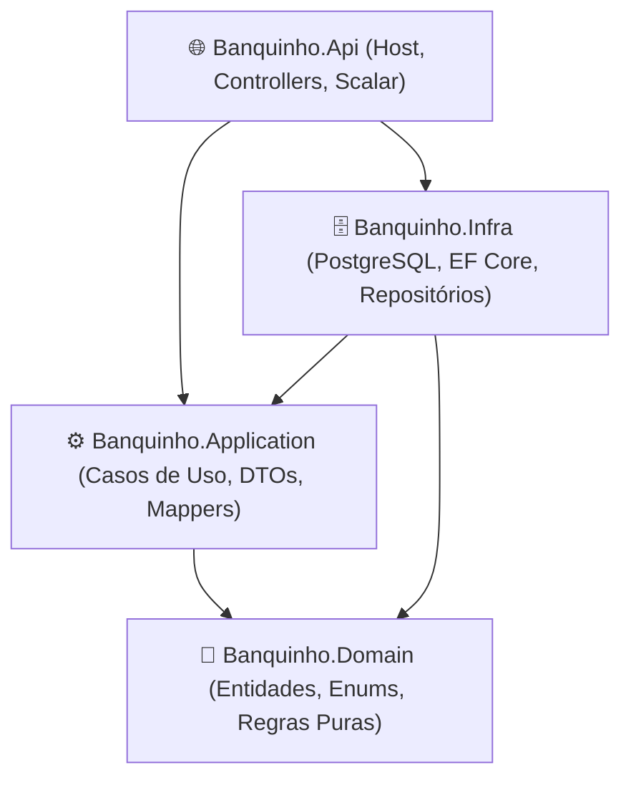

# 🏦 Banquinho — Enterprise Banking Sandbox

> **Aviso Importante: Projeto Educativo & Laboratório de Over-Engineering Consciente**  
> Este projeto **não busca ser minimalista**. Pelo contrário: ele foi concebido deliberadamente como um ambiente de **over-engineering proposital e educativo**. O objetivo central é explorar, dissecar e levar ao extremo os padrões arquiteturais corporativos mais robustos do mercado (.NET 10, Clean Architecture, DDD, CQRS, Arquitetura Hexagonal, Event Sourcing, Outbox Pattern, Concorrência Otimista/Pessimista e Testes de Carga) em um domínio rico e crítico: o **financeiro**.

---

## 🎯 Proposta & Filosofia

Por que criar um canhão para matar uma formiga?  
Em cenários do mundo real, sistemas bancários e fintechs lidam com consistência transacional estrita, rastreabilidade, alta volumetria e auditoria regulatória. Aplicar esses padrões em um projeto de brinquedo ou CRUD convencional costuma ser desnecessário, mas aqui **o aprendizado técnico e a profundidade de engenharia de software são a prioridade máxima**.

Aqui, nós implementamos e testamos na prática:

- **Clean Architecture** e isolamento estrito de dependências.
- **Domain-Driven Design (DDD)** tático e estratégico.
- **CQRS (Command Query Responsibility Segregation)** e _Vertical Slice Architecture_.
- **Arquitetura Hexagonal (Ports & Adapters)**.
- **Validação Fail-Fast** com `FluentValidation`.
- **Mapeamento de alta performance** sem reflexão (Métodos de Extensão puros).
- **Persistência desacoplada** com Entity Framework Core e PostgreSQL.

---

## 🏗️ Arquitetura Atual da Solução

A solução segue as diretrizes da **Clean Architecture**, dividida em 4 camadas bem delimitadas:



- **`Banquinho.Domain`**: O coração do negócio. Contém entidades puras (`Account`, `Customer`, `Enterprise`) e enums (`AccountType`). Zero dependências externas.
- **`Banquinho.Application`**: Regras de aplicação, DTOs (`Requests` e `Responses`), validadores do FluentValidation, interfaces de repositório/serviço e mappers manuais de alta performance (`AccountMapper`).
- **`Banquinho.Infra`**: Camada de persistência. Contém o `BanquinhoDbContext`, mapeamentos com Fluent API, controle de Migrations e implementações dos repositórios via EF Core.
- **`Banquinho.Api`**: A camada de entrega HTTP. Configura a injeção de dependência, migrations automáticas no startup, documentação interativa via **Scalar** e expõe os endpoints REST.

---

## 🚀 Tecnologias & Ferramentas

- **Linguagem & Runtime:** C# 13 / .NET 10
- **Banco de Dados:** PostgreSQL 16 (via Docker)
- **ORM:** Entity Framework Core 10 (com driver `Npgsql`)
- **Validação:** FluentValidation 12
- **Documentação de API:** Scalar API Reference (`Scalar.AspNetCore`)
- **Containerização:** Docker & Docker Compose

---

## 🛠️ Como Executar a Aplicação

### 1. Pré-requisitos

- [.NET 10 SDK](https://dotnet.microsoft.com/) instalado.
- [Docker Desktop](https://www.docker.com/) rodando.

### 2. Subir o Banco de Dados (PostgreSQL + pgAdmin)

Na raiz do repositório, execute:

```bash
docker compose up -d
```

Isso iniciará:

- **PostgreSQL** na porta `5432` (`user: postgres`, `password: postgres`, `database: banquinho_db`).
- **pgAdmin 4** na porta `5050` (`email: admin@banquinho.com`, `password: admin`).

### 3. Rodar a API

Execute a API pelo terminal:

```bash
dotnet run --project src/Banquinho.Api/Banquinho.Api.csproj
```

> **Nota de Conveniência:** O projeto já está configurado para executar as **migrations automaticamente no startup** (`dbContext.Database.Migrate()`). Você não precisa rodar `dotnet ef database update` manualmente.

### 4. Acessar a Documentação Interativa

Com a API rodando, abra o navegador em:
👉 **`https://localhost:7000/scalar/v1`** (ou a porta informada no terminal).

---

## 📊 Estado Atual do Projeto

- [x] Modelagem de Entidades do Domínio (`Customer`, `Enterprise`, `Account`, `AccountType`).
- [x] Mapeamento Relacional via Fluent API e Migrations iniciais.
- [x] Validação robusta de abertura de contas com `FluentValidation` (regras para PF vs PJ, limites para conta investimento, depósito inicial).
- [x] Mappers estáticos com Extension Methods (`ToEntity` e `ToResponse`).
- [x] Repositório `AccountRepository` com EF Core otimizado (`AsNoTracking`).
- [x] Endpoints funcionais:
  - `POST /api/accounts` (Abertura de conta com retorno 201 Created e header Location).
  - `GET /api/accounts/{id}` (Consulta de conta por ID com 200 OK / 404 Not Found).
- [ ] Próximos passos: Implementação de CQRS, Arquitetura Hexagonal, tratamento global de erros, cadastro de clientes e transações financeiras.

---
